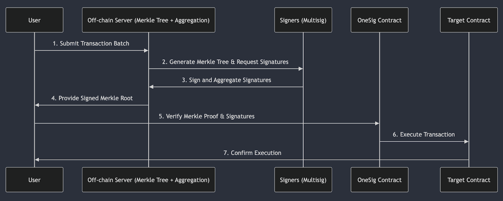

# OneSig Protocol Implementation

## Overview
OneSig is a smart contract solution designed to streamline the signing and execution of arbitrary ‘calldata’ on multiple blockchains.
This is achieved by introducing a pre-authorization mechanism.
Instead of requiring individual approvals for every transaction, OneSig enables batched pre-authorization of many transactions.
This eliminates inefficiencies and delays caused by repeated approvals, reducing operational overhead and improving deployment and contract configuration scalability.

## Background and Motivation
When LayerZero deploys a new Endpoint, every other endpoint within every ecosystem LayerZero supports needs to be updated with the newly created address.

Currently adding or modifying an endpoint is an unsustainable process due to the following challenges:

1. **Exponential Configuration Growth**: Each new endpoint requires reconfiguration of all existing endpoints, resulting in hundreds of configuration updates per addition.
2. **Multisig Execution Bottlenecks**: Every configuration change must be manually approved by a multisig on each local chain, causing significant delays.
3. **Infrastructure Overhead**: The LayerZero team must deploy a Gnosis Safe multisig and maintain an indexing server on every new chain, introducing complexity and unreliability.
4. **Stargate and LayerZero Applications(OApps)**: This issue extends to Stargate and all LayerZero-powered applications, making global scalability difficult.

## One Sig, Omni Executions
OneSig is an extension of a multisig system that integrates **Merkle Proofs**, introducing a **permissionless execution model** where:

1. A series of transactions for multiple chains is pre-authorized via a Merkle root + a group signature.
    1. Nonce enforces order
    2. Can be grouped atomically or successive via each leaf. I.e. A leaf can contain 1 or many individual transactions
2. Series of transactions can be executed provided they:
   1. Have not been executed before.
   2. Previous nonce has been executed.
   3. Are not expired.
   4. Are executed on the correct chain.
   5. Have a valid Merkle proof.

## Architecture (Flow)



1. **Submit Transaction Batch**: The **User** submits a batch of transactions to the **Off-Chain Server**.
2. **Generate Merkle Tree & Request Signatures**: The **Off-Chain Server** creates a Merkle tree and sends the Merkle Root, Transactions, and Expiry to Signers for approval.
3. **Sign and Aggregate Signatures**: Signers (Multisig) sign the Merkle root, and the **Off-Chain Server** aggregates signatures.
4. **Provide Signed Merkle Root**: The **Off-Chain Server** returns the signed Merkle root to the **User**.
5. **Submit Execution Request**: The **User** (or anyone) submits the execution request to the Executor, including the Merkle proof and signatures. The OneSig Contract verifies these before allowing execution.
6. **Execute Transaction**: The **OneSig Contract** executes the transaction calls on the **Target Contracts**. 
7. **Confirm Execution**: The Blockchain finalizes the execution, and the **User** confirms success.

## Core Concepts

### Multisig Authorization (Pre-Signing)
- A list of transactions is pre-signed by a set of trusted signers.
- These transactions are committed as a Merkle tree, ensuring integrity.
- The signers only need to sign once for the entire batch of transactions across multiple chains/OneSig deployments

### Execution
- Execution can be permissionless depending on [executor configuration](#executor-configuration)
- Execution is validated against the pre-approved Merkle root.
- Each transaction is checked for:
  - Valid Merkle proof
  - Expiry status
  - Correct chain
  - Correct contract
  - Correct nonce (ordered execution)

### Merkle-Based Transaction Verification
- Transactions are stored as Merkle leaves.
- A Merkle proof confirms that an execution request is part of the approved set.
- Verification prevents unauthorized or duplicate executions.

### Leaf Encoding

#### Standard Leaf Header Encoding
```

[0][1..8][9..40][41..48]
 |    |       |       |
 |    |       |       \ --- 8bytes: nonce
 |    |       |
 |    |       \ --- 32bytes: contract
 |    |
 |    \ --- 8bytes: oneSigId
 |
 \ --- 1byte: version

```

- `version`: Any implementations following this document should have this set to 1.
- `oneSigId`: an 8 byte identifier representing a deployment
- `contract`: a 32 byte identifier representing a deployment
- `nonce`: an 8 byte unisgned integer representing ordering information

#### Full Leaf Encoding
OneSig implementations can implement this process differently from one-another, but the first item that goes into the hash must be the [Standard Leaf Header](#standard-leaf-header-encoding)

Any data included pre-hash into the leaf can be unique per implementation, but to prevent payloads being valid on unintended contracts the prefix must be standardized.

Leafs are double hashed using keccak256.

```
// Double hash leaf data
LEAF_DATA = [Leaf Header][Leaf Prefix]
keccak256(keccak256(LEAF_DATA))
```

## Signature/Verification
Although there can be differences within the Merkle-Tree payload for any given OneSig implementation, they all must adhere to the standardized signature specification.

OneSig Signatures are based on [EIP-712](https://eips.ethereum.org/EIPS/eip-712), thus are signed by Ethereum-compatible addresses.

### Signature Parameters

#### Domain Separator
OneSig uses fixed values for the [signature domain separator](https://eips.ethereum.org/EIPS/eip-712#definition-of-domainseparator).

- `string name` = `OneSig`
- `string version` = `0.0.1` - The current version of the OneSig implementation.
- `uint256 chainId` = `0x01` - All signatures are signed to be used referencing the Ethereum Mainnet ChainId, no matter the target chain.
- `address verifyingContract` - `0x000000000000000000000000000000000000dEaD` - A static "dead" address that is shared across all implementations.

Note: `salt` can be provided here but is omitted.

Note: Although the domain-separator parameters are static across different deployments of **OneSig**, the risk of replay/unintentional signing attacks is mitigated due to the use of unique seeds, unique signers, and incrementing nonces. 

#### Payload
The payload is encoded as an ABI in the format `SignMerkleRoot(bytes32 seed,bytes32 merkleRoot,uint256 expiry)`
- `bytes32 seed` A seed defined that must match the seed defined in the contract at time of execution.
- `bytes32 merkleRoot` The root of the Merkle Tree being executed upon.
- `uint256 expiry` The time in which the signature should expire.


### Combining Multiple Signatures
OneSig implementations take multiple signatures as a concatenate of multiple EIP-712 outputs.
Before concatenation, signatures must be sorted in ascending order by the numerical representation of the signer.


### Example Combined Logic
Provided are examples for signing+sorting in TypeScript and examples of validating the order in EVM

This example uses `TypedDataSigner` from `@ethersproject/abstract-signer`

```ts
interface SingerWithAddress extends TypedDataSigner {
    address: string;
}
async function sign(tree: MerkleTree, unsortedSigners: SingerWithAddress[], seed: Uint8Array, expiry: BigNumber | string) {
    const sortedSigners = [ ...unsortedSigners ].sort(function(a, b) {
        const aNumeric = BigInt(a.address);
        const bNumeric = BigInt(b.address);

        if (aNumeric === bNumeric) {
            return 0
        } else {
            return aNumeric < bNumeric ? -1 : 1
        }
    });
    
    const signatures = [];
    for (const signer of sortedSigners) {
        const signature = await signer._signTypedData(
            {
                name: 'OneSig',
                version: '0.0.1',
                chainId: 1, // this is hardcoded to Ethereum mainnet
                verifyingContract: '0x000000000000000000000000000000000000dEaD', // this is hardcoded to a dead address
            },
            {
                SignMerkleRoot: [
                    { name: 'seed', type: 'bytes32' },
                    { name: 'merkleRoot', type: 'bytes32' },
                    { name: 'expiry', type: 'uint256' },
                ],
            },
            {
                seed: seed,
                expiry: expiry,
                merkleRoot: tree.getRoot(),
            }
        );
        
        // Remove starting '0x' from signature;
        const withoutPrefix = signature.substring(2);
        
        const signatureBytes = Buffer.from(withoutPrefix, 'hex');
        
        signatures.push(signatureBytes);
    }
    
    // Return the concatenated signatures
    return Buffer.concat(signatures);
}
```


```solidity
// Example verification of order within solidity contract
import { ECDSA } from "@openzeppelin/contracts/utils/cryptography/ECDSA.sol";

contract VerifyOrder {
    function ensureSignatureOrder(
        bytes32 digest, // the signed payload -- not important for this example
        bytes calldata combinedSig // the combined signature
    ) external view {
        // One signature is 65 bytes long, so the length of any un-compressed combination will be a multiple of 65
        require(combinedSig.length % 65 == 0, "Signature length must be multiples of 65");

        address lastSigner = address(0);
        
        uint256 pos = 0;
        while (pos < combinedSig.length) {
            bytes calldata signature = combinedSig[pos:pos + 65];
            
            address signer = ECDSA.recover(digest, signature);
            
            // Require that the signer is greater than and not equal to the previous
            require(signer > lastSigner, "Signers out of order");
            
            pos += 65;
        }
    }
}
```

## Contract Implementation Reference

### Contract Configuration
Each implementation must store a `seed` and a `nonce`, with the following rules applied for modification:
- `seed` - The seed is an opaque piece of data defined by the contract owners to prevent replay-attacks.
  - Changing this follows the same multi-sig process as defined in  (See [Signer Management](#signer-management)).
- `nonce` - This nonce is an integer representing the count of successfully executed transactions within a specific OneSig implementation.
  - Must be initialized with zero.
  - Must be incremented by one after a successful execution.
  - Can never be modified outside of these two cases.
- `signerThreshold` - This number represents the amount of unique signers needed to execute a transaction.

### Signer Management
Adding or removing signers from a OneSig implementation must meet the following criteria:
- One or more signer(s) must always be defined (contract must be initialized as such).
- Modifying signers must require the same `signerThreshold` (or more) of signatures as executing a transaction.
- At any given point in time, the count of signers within the contract must not fall below the threshold defined.

### Signature Verification Implementation
Each implementation must be able to verify signatures.

These verifications must:
- Use the signers defined in the contract (See [Signer Management](#signer-management)).
- Use the signature specification referenced (See [Signature/Verification](#signatureverification)).


## Transaction Execution

## Executor Configuration
Contracts must store two pieces of information
 - executors `set<address>` a set of (VM specific) addresses that can execute transactions 
 - executorRequired `boolean` if `executors` is checked or if permissionless execution is enabled.

Modification to either of these variables should require signer approval.

Signers are considered executors, and the `executors` array is allowed to be empty when `executorRequired` is true.

When a call is made to execute a transaction, the executor must be added or permissionless execution must be enabled.

### Flow

The flow of transaction execution is as follows:
1. Check `executorRequired`
    1. If `true` check that the sender is either a valid signer or within the `executors` array.
    2. If `false` continue
2. Receives `merkleRoot`, `expiry`, `signature`, `transactionData`, and `proof`.
3. Validates the `signature` correctly signs the `merkleRoot` (See [Signature/Verification](#signatureverification)).
4. Ensures that `transactionData` / `proof` are included within the `merkleRoot`.
   1. Computes the leaf for the `transactionData` (See [Leaf Encoding](#leaf-encoding)).
   1. Ensures that the `proof` is valid referencing the computed leaf and `merkleRoot`.
5. Execute each call within transaction data; how this data is formatted can be unique per-implementation.
6. Increment the stored `nonce` by `1`.

### Conclusion
OneSig provides a scalable, execution model that can simplify LayerZero Endpoint and OApps configuration. By leveraging Merkle proofs, OneSig improves upon the inefficiencies of traditional multisig approvals, enabling faster, more reliable deployments across multiple chains.
